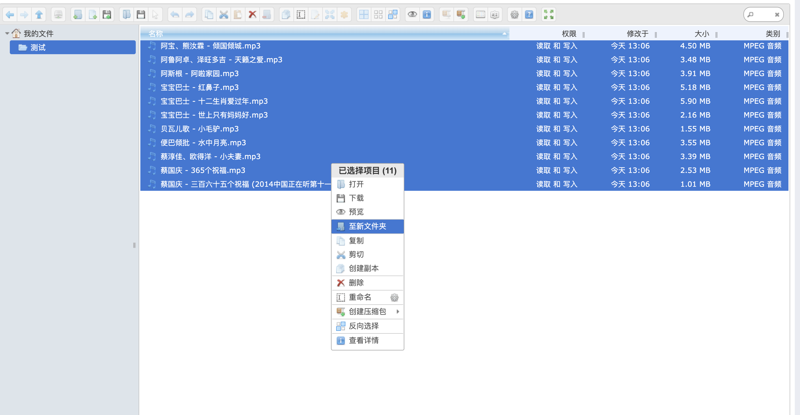
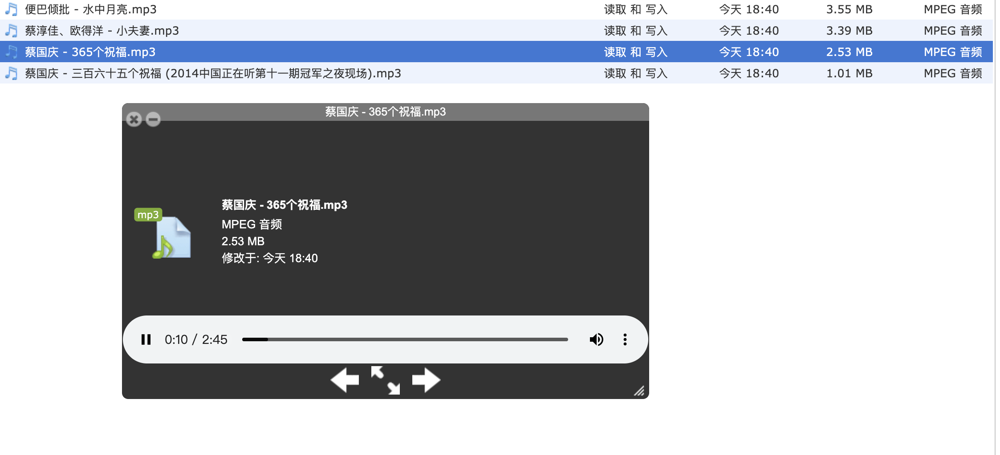

# 基于Spring-boot和elfinder 的在线文件管理系统
   

基于Spring-boot和elfinder的打造在线文件管理系统，可以用于网盘、云盘

1. 支持在线文件下载
1. 支持目录上传
1. 支持zip tar Gzip 的在线解压和压缩文件夹
1. 支持多种文本格式的高亮显示和在线编辑
1. 支持在线文件预览
1. 支持文件夹权限设置
1. 支持国际化
1. 支持docker

1. 操作

   

1. 上传文件

2. 文件预览

1. 运行
    1. 拉取最新包，代码中找到CodePanApplication.java，运行main方法即可运行
    2. 访问链接: http://localhost:9090/pan
    
2. 部署
    1. 在idea侧边栏找到maven点击code-pan->Lifecycle->package，完成打包
    2. 拷贝./target/code-pan-0.0.1-SNAPSHOT.zip 到目标服务器
    3. 在服务器中执行 unzip code-pan-0.0.1-SNAPSHOT.zip && chmod 755 deploy.sh完成解压授权工作
    4. 执行 ./deploy.sh start     实现启动
    5. 执行 ./deploy.sh restart   实现重启
    6. 执行 ./deploy.sh stop      实现停止

3. docker部署
    1. 执行上述步骤的打包操作
    2. docker打包部署详见:  [docker部署](./Docker-README.md)

